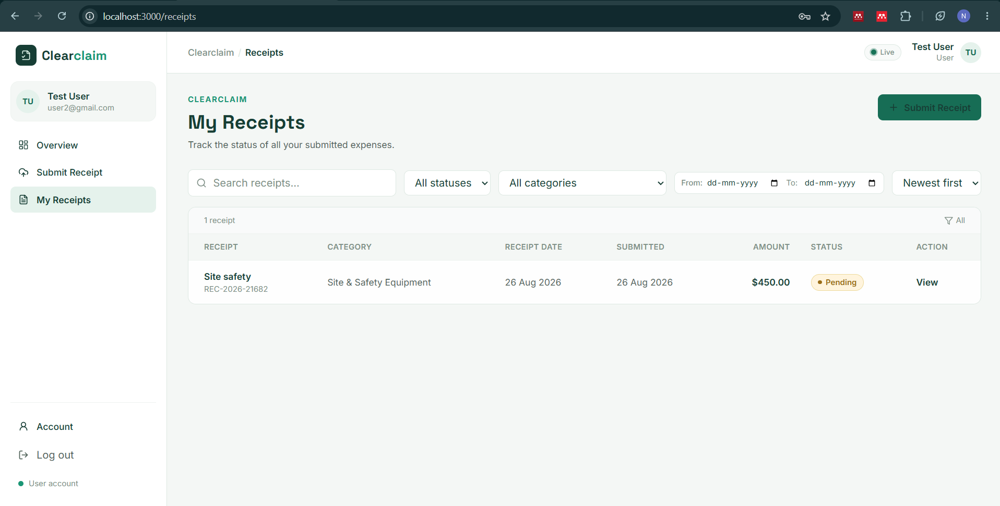
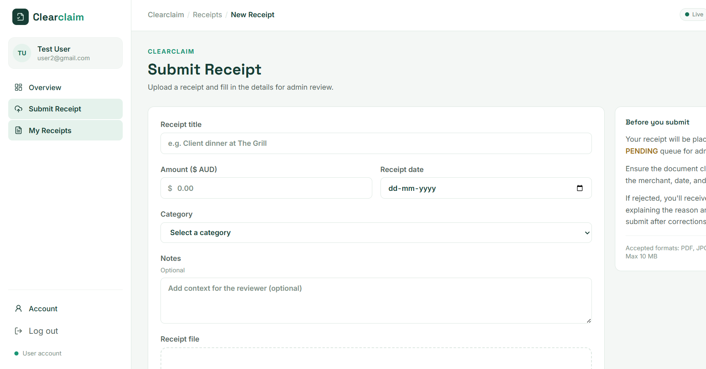
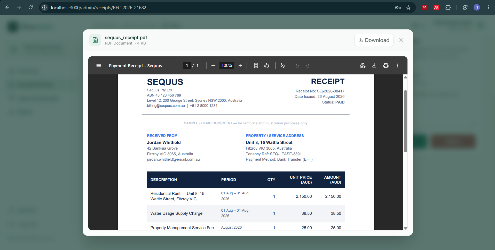
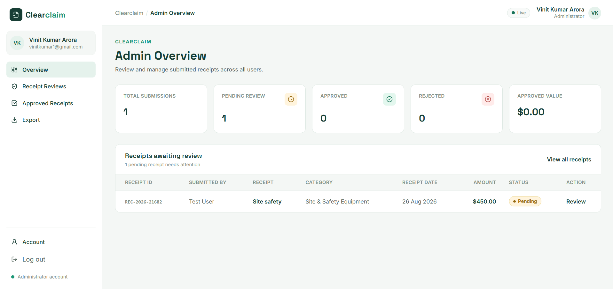
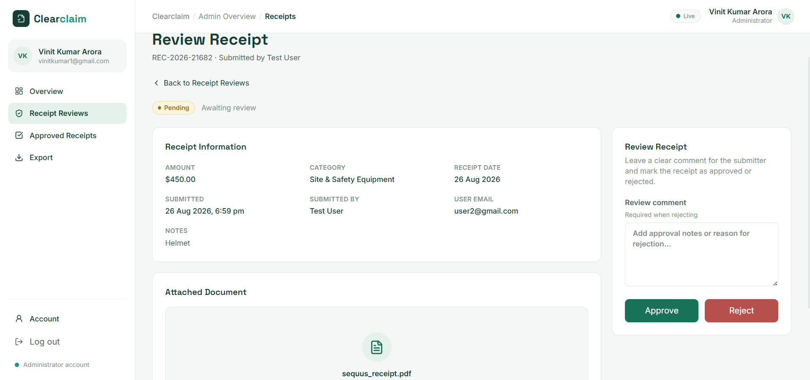
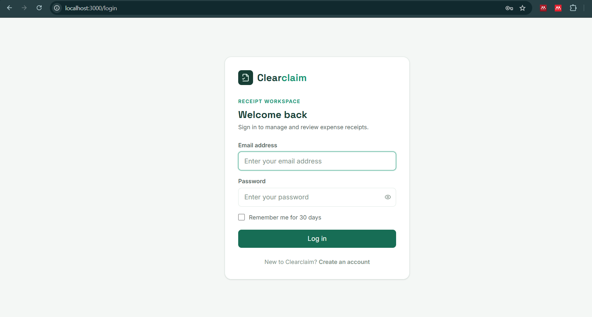
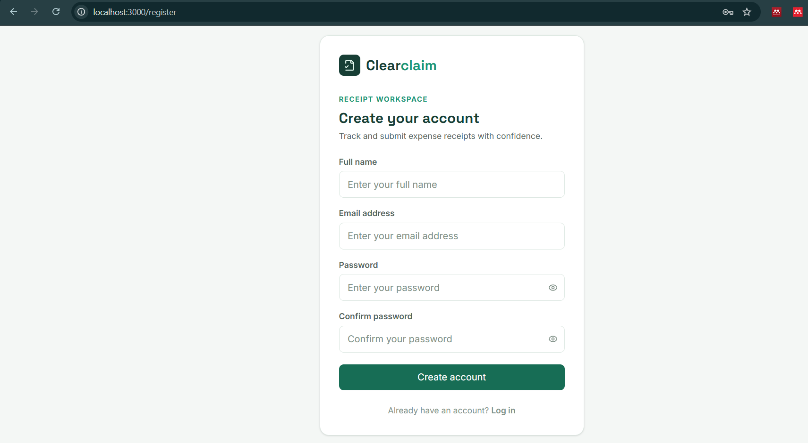

# Receipt Processing Dashboard (Clearclaim)

A full-stack web application for corporate expense submission, verification, and audit workflows built with **FastAPI** and **React**.

Configured for Australian expense workflows ($ AUD) and tailored for project management and consulting environments (e.g. Sequus Consulting).

🎥 **Demo Video:** [https://youtu.be/390QNXYdQEE](https://youtu.be/390QNXYdQEE)

---

## Overview

The platform provides a split-role interface for expense lifecycle management:

- **Submitters (Users):** Upload receipts/invoices (PDF, PNG, JPEG), record metadata in AUD (date, amount, category, notes), preview uploaded documents in an in-app lightbox with zoom and pan, and receive instant status updates via WebSockets when claims are reviewed.
- **Reviewers (Admins):** Review submissions company-wide, filter across submitters, categories, date ranges, and approval statuses (`PENDING`, `APPROVED`, `REJECTED`), inspect attached documents, approve or reject claims with audit feedback, and export formatted reports directly to **CSV** and styled **Excel (`.xlsx`)** spreadsheets.

---

## UI Preview

<details open>
<summary><b>👤 Submitter (User) Experience</b></summary>
<br>

| User Dashboard | Expense Claim Upload |
| :---: | :---: |
|  |  |

| Document Lightbox (Zoom & Pan) |
| :---: |
|  |

</details>

<details>
<summary><b>🛡️ Reviewer (Admin) Workflow</b></summary>
<br>

| Admin Audit & Filter Dashboard | Review & Audit Decision Modal |
| :---: | :---: |
|  |  |

</details>

<details>
<summary><b>🔐 Authentication</b></summary>
<br>

| Sign In | Sign Up |
| :---: | :---: |
|  |  |

</details>

---

## Architecture & Tech Stack

```
Frontend (React 18 + TypeScript + Vite + Tailwind CSS)
    │
    ├── HTTP REST (Axios) -> Authentication, Receipts CRUD, Admin Reviews, File Streaming
    └── Native WebSockets -> Instant real-time review & submission notifications
    │
Backend (FastAPI + Python 3.12 + SQLAlchemy 2.0 ORM)
    │
    ├── Security: Argon2id password hashing (pwdlib) + Signed JWT (HS256)
    ├── Multi-tenancy: Strict IDOR resource ownership enforcement
    ├── File Pipeline: Collision-safe UUID storage + MIME whitelist + Path traversal checks
    └── Export Engine: In-memory openpyxl & csv streaming (Zero-disk RAM processing)
    │
Persistence: SQLite Database (`receipt_dashboard.db`) + Local Uploads / Docker Volume
```

---

## Quick Start

### 1. Run with Docker Compose (Recommended)

Ensure Docker Desktop is installed and running, then execute:

```bash
git clone https://github.com/vinitk1509/Receipt_Processing_Dashboard.git
cd Receipt_Processing_Dashboard

docker compose up --build -d

docker compose exec backend python -m app.scripts.seed_demo
```

**Frontend:**
http://localhost:3000

**Swagger:**
http://localhost:8000/docs

#### Test Credentials

**USER**  
- Email: `user2@gmail.com`  
- Password: `Password123`  

**ADMIN**  
- Email: `vinitkumar1@gmail.com`  
- Password: `Password123`  

To stop:
```bash
docker compose down
```

---

### 2. Run Locally (Manual Development)

#### Backend Setup

```bash
cd backend

# Create & activate virtual environment
python -m venv .venv

# On Windows:
.venv\Scripts\Activate.ps1
# On macOS/Linux:
source .venv/bin/activate

# Install dependencies
pip install -r requirements.txt

# Start FastAPI development server
uvicorn app.main:app --reload --port 8000
```
Backend will be live at `http://127.0.0.1:8000`.

#### Frontend Setup

In a separate terminal:

```bash
cd frontend
npm install
npm run dev
```
Frontend will be live at `http://localhost:5173`.

---

## Admin Account Provisioning

To create or promote an admin user, run the CLI utility:

```bash
cd backend
python -m app.scripts.create_admin --email vinitkumar1@gmail.com --password "YourAdminPassword123" --name "Vinit Kumar Arora"
```

---

## REST API Reference

| Method | Endpoint | Auth | Description |
|---|---|---|---|
| `POST` | `/api/auth/register` | Public | Create new user account and obtain JWT |
| `POST` | `/api/auth/login` | Public | Authenticate user and obtain JWT |
| `GET` | `/api/auth/me` | User / Admin | Get profile of currently authenticated user |
| `GET` | `/api/receipts/me` | User / Admin | List receipts submitted by current user |
| `POST` | `/api/receipts` | User / Admin | Submit new expense claim with document upload |
| `GET` | `/api/receipts/{id}` | User / Admin | Get single receipt (enforces IDOR ownership) |
| `GET` | `/api/receipts/{id}/file` | User / Admin | Stream/download attached receipt file |
| `GET` | `/api/admin/receipts` | Admin only | List and filter all company receipts |
| `GET` | `/api/admin/receipts/{id}` | Admin only | Get receipt review details |
| `PATCH` | `/api/admin/receipts/{id}/approve` | Admin only | Approve receipt with optional comment |
| `PATCH` | `/api/admin/receipts/{id}/reject` | Admin only | Reject receipt with mandatory comment |
| `GET` | `/api/admin/receipts/export/csv` | Admin only | Export filtered receipts as CSV |
| `GET` | `/api/admin/receipts/export/excel` | Admin only | Export filtered receipts as styled Excel (`.xlsx`) |
| `WS` | `/ws/notifications/{user_id}` | Public | WebSocket channel for real-time push events |

---

## Security Implementation

- **Password Hashing:** Uses **Argon2id** via `pwdlib[argon2]`, resistant to GPU-accelerated brute-force attacks.
- **Stateless Authentication:** Cryptographically signed JSON Web Tokens (JWT) using `HS256`.
- **Role-Based Access Control (RBAC):** Backend route guards (`Depends(get_current_admin)`) verify database role on every privileged endpoint.
- **IDOR Protection:** Receipt queries strictly verify that `receipt.user_id == current_user.id` unless the requester is an Admin.
- **File Upload Defenses:**
  - File extension and MIME type whitelisting (`.pdf`, `.jpg`, `.jpeg`, `.png`).
  - Max upload size enforcement (10 MB).
  - Collision-proof UUID file naming on disk.
  - Path traversal checks ensuring resolved destination stays within upload directory.
- **SQL Injection Prevention:** 100% parameterized queries via SQLAlchemy 2.0 ORM.
- **Future Date Prevention:** Date validation on both frontend and backend prevents entering future receipt dates.

---

## Testing

The repository contains an automated Pytest test suite covering authentication, IDOR cross-tenant isolation, admin review lifecycles, and export formatting.

```bash
cd backend
pytest -v
```

```text
tests/test_admin_workflow.py::test_admin_workflow_and_rbac PASSED        [ 25%]
tests/test_auth.py::test_user_registration_and_login PASSED              [ 50%]
tests/test_phase5_export.py::test_exports PASSED                         [ 75%]
tests/test_receipts_isolation.py::test_receipt_creation_and_cross_user_isolation PASSED [100%]

======================== 4 passed in 1.60s =========================
```

Frontend type-check and production build:

```bash
cd frontend
npm run build
```

---

## License

Created for the Sequus technical assessment.
